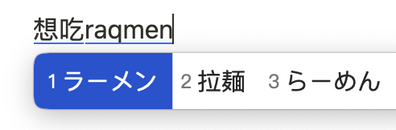

# RIME-ginkyo

一个小鹤双拼和日语混输的 RIME 方案

# 参考
- [薄荷输入法](https://github.com/Mintimate/oh-my-rime)
- [rime-japanese](https://github.com/gkovacs/rime-japanese)
- [中日英自然码（带辅码）双拼输入法](https://github.com/lippmann/lrime)
